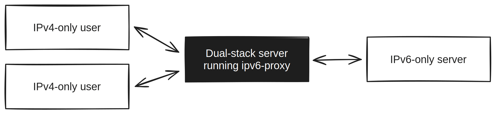

# ipv6-proxy

Allow IPv4 clients to access a specific IPv6-only service.



In the future, everyone will have IPv6 access and the world will be good. Unfortunately we live in the present, and [many providers are still IPv4-only](https://www.google.com/ipv6/).

This repository contains everything you need to run a proxy server that enables IPv4-only clients to speak with an IPv6-only server.

It'll set things up so that it automatically starts up on a reboot. It'll also handle updating DNS entries, so if your IPv6-only server is moving around it'll stay working (well, with up to 1 hour of downtime - tweak polling interval in [`ipv6-proxy.sh`](./ipv6-proxy.sh)).

## Requirements

- A linux dual stack host (tested on Ubuntu). You can check your networking works with curl:
    ```bash
    curl -4 ipinfo.io/ip
    curl v6.ipinfo.io/ip
    ```
- `dig`, `socat` and `systemd` installed. On Ubuntu, you can install these with:
    ```bash
    sudo apt update
    sudo apt install -y dnsutils socat systemd
    ```

## Setup

1. Clone this repository into the machine's home directory and open it with `cd $HOME && git clone https://github.com/domdomegg/ipv6-proxy.git && cd ipvy-proxy`
2. Save the target domain as target.txt: `echo "google.com" > target.txt` (change as necessary)
3. Run the install script: `./install.sh`

By default this will forward ports 80 and 443. To forward other ports, tweak [`ipv6-proxy.sh`](./ipv6-proxy.sh).

## Uninstalling

1. Run `./uninstall.sh`
